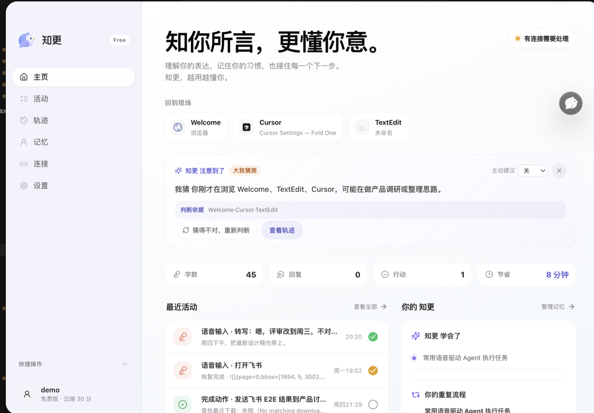
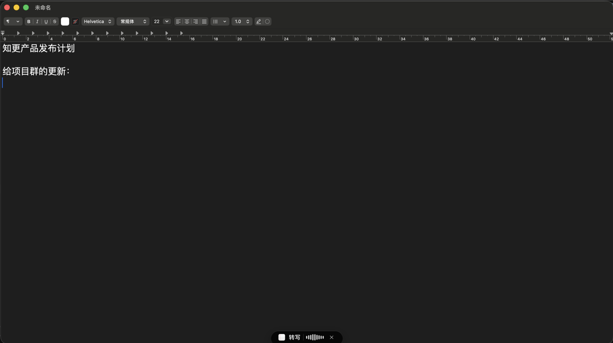
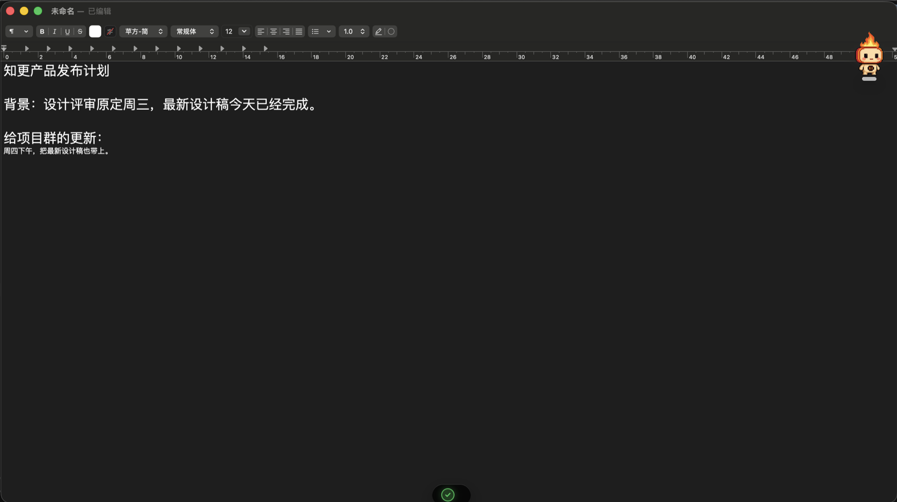
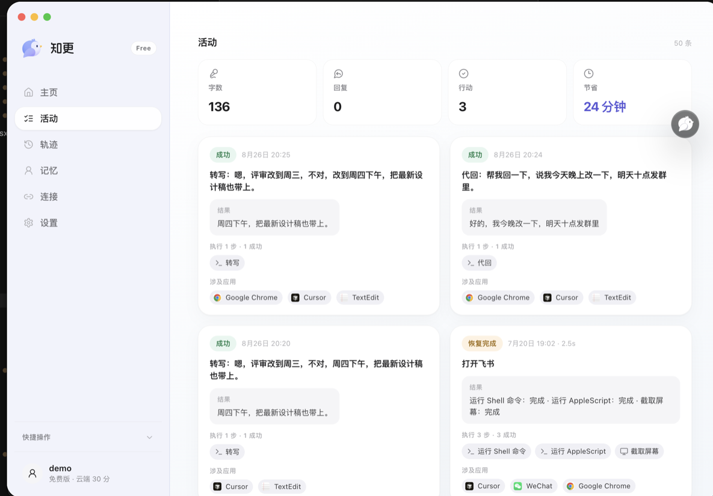
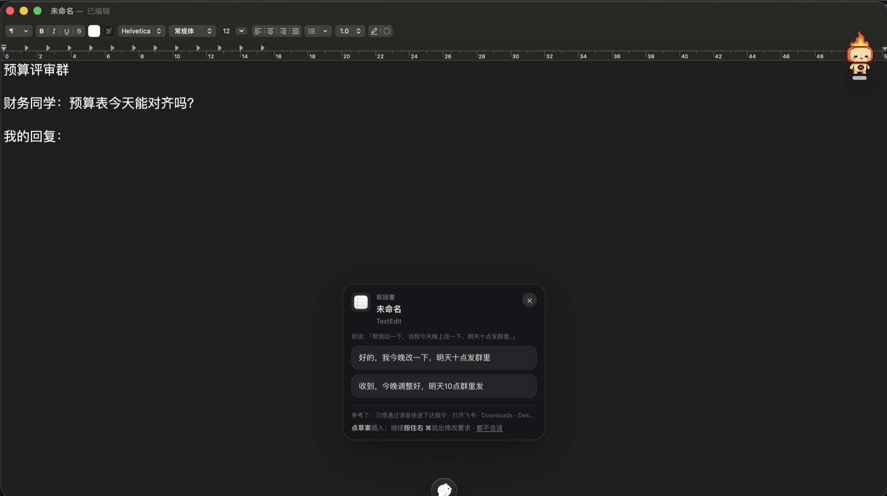
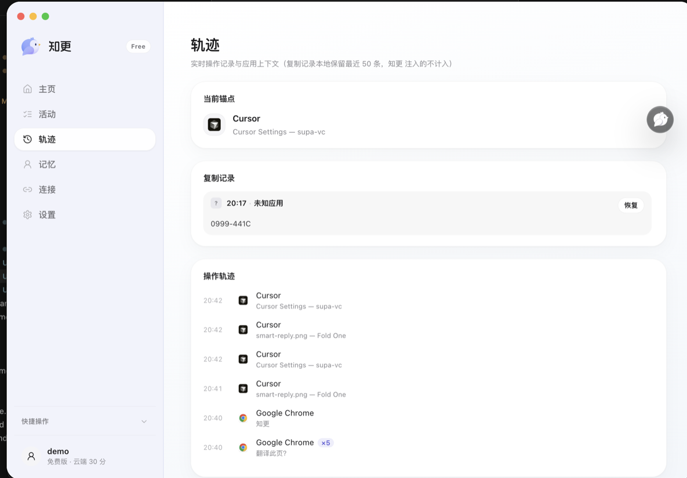
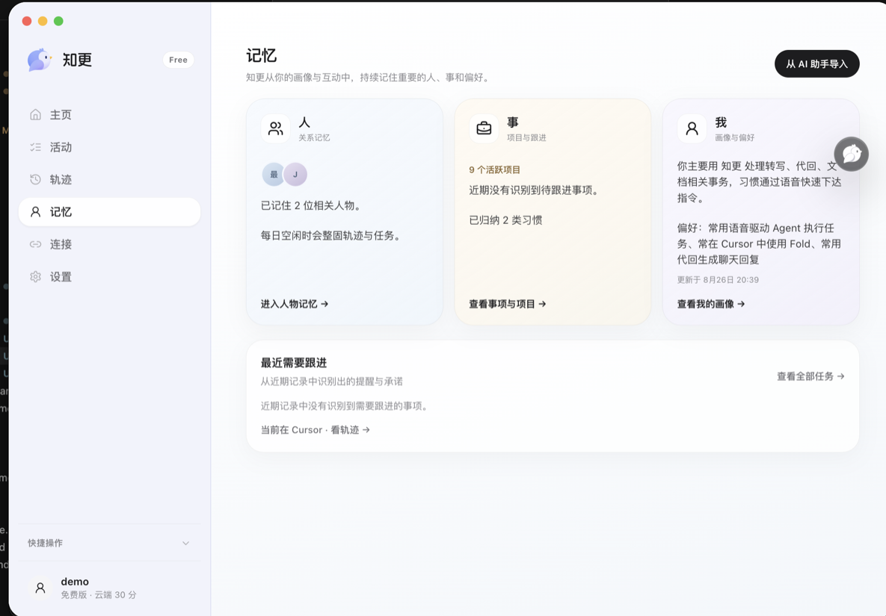
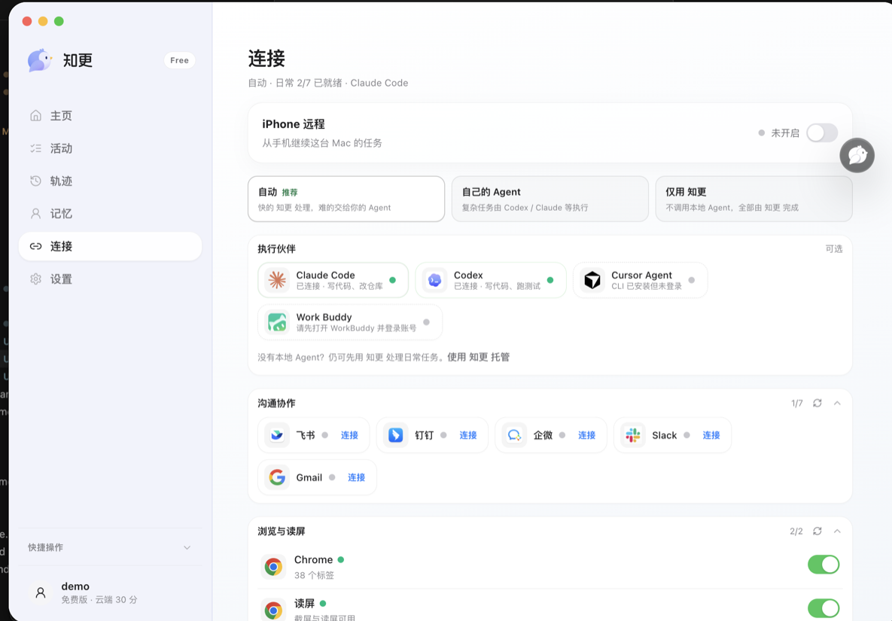
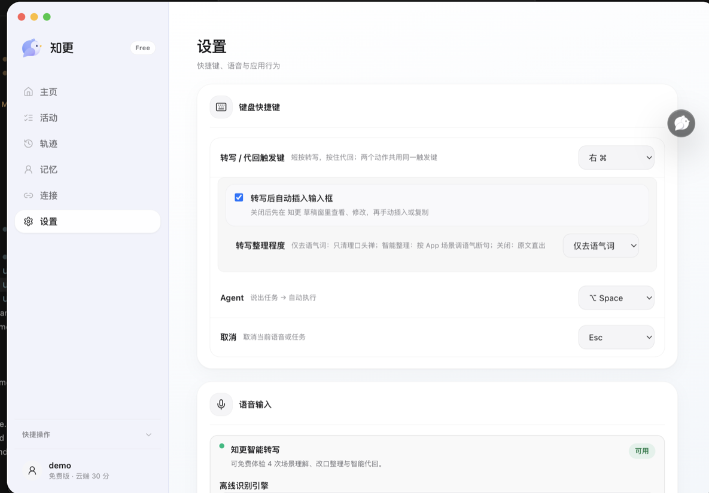

<div align="center">
  
  <h1>知更 Zhigeng</h1>
  <p><strong>AI 不缺能力，缺的是认识你。</strong></p>
  <p>独立、厂商中立的语音输入与记忆 Agent</p>
  <p><a href="README.md">简体中文</a> · <a href="README_EN.md">English</a></p>
  <p>
    <a href="https://zhigeng.app"></a>
    <a href="https://zhigeng.app/Zhigeng-mac-arm64.dmg"></a>
    <a href="https://github.com/Littlesheepxy/zhigeng/releases"></a>
    <a href="LICENSE"></a>
  </p>
  <p>
    <a href="https://zhigeng.app">官网</a> ·
    <a href="https://zhigeng.app/Zhigeng-mac-arm64.dmg">下载 macOS</a> ·
    <a href="https://github.com/Littlesheepxy/zhigeng/releases">Release</a> ·
    <a href="mailto:littleyang78@gmail.com">联系作者</a>
  </p>
</div>

知更是一个独立、厂商中立的语音输入与记忆 Agent。它不要求你迁移到新的聊天框，也不把你的记忆锁在某一家模型或大厂账号里。

**语音听见你的意图，输入留下你的表达，本地轨迹记录你真正做过的事。** 知更在你允许的范围内，把这些线索沉淀成属于你的长期记忆——可查看、可修改、可删除，并交给你选择的模型与 Agent 使用。

于是，你不必一次次解释背景：

> **你说得越来越少，Agent 做得越来越对。**

在 Mac 上，知更负责语音输入、情境代回和调度 Codex、Claude Code 等本地 Agent；正在研发的 iOS 版将成为随身记忆终端和本地 Agent 遥控器，让你在路上也能记录上下文、延续工作，并向家中或办公室的 Mac 发出指令。

**不是把你交给某一个 AI，而是把属于你的上下文带给你选择的 AI。**

[zhigeng.app](https://zhigeng.app) · 源码按 [PolyForm Noncommercial 1.0.0](LICENSE) 公开：**可以看、可以改、可以自用和研究，不可以商用。**

面向用户的产品名是 **知更**；本仓库工程包名仍为 `@fold/*`。

## 下载

| | |
|---|---|
| **官网** | [https://zhigeng.app](https://zhigeng.app) |
| **macOS 安装包** | [https://zhigeng.app/Zhigeng-mac-arm64.dmg](https://zhigeng.app/Zhigeng-mac-arm64.dmg)（Apple Silicon，已签名公证） |
| **Release 说明** | [github.com/Littlesheepxy/zhigeng/releases](https://github.com/Littlesheepxy/zhigeng/releases) |

打开官网点下载即可，不需要内测码。

大模型不能在本机「下一个 LLM 就能用」——语音可以完全本地（SenseVoice / Whisper）；推理请在设置里填**你自己的云端 API Key**（BYOK，密钥只存本机钥匙串）。

## 截图

### 主页 · 情境感知

看当前窗口、对话、剪贴板和正在推进的事；Menu Bar 常驻，不抢焦点。



### 语音输入 · 开口即成稿

短按 **右 ⌘** 开始转写。不是逐字听写：改口会修好，口头禅可以去掉，并按飞书 / 微信 / 邮件调语气。

<p align="center">
  
  
</p>

### 活动 · 转写、代回与执行

每一次语音输入、代回草案和本地动作都有记录，可回看原文与整理结果。



### 情境代回 · 读懂对话再给草案

长按 **右 ⌘**。按对方和应用给出多条可选回复，点一条插入真实输入框，再决定发不发。



### 轨迹 · 操作上下文

实时记录你在哪些 App、哪些窗口里工作，以及复制记录，供情境理解与代回参考。



### 记忆 · 人、事与你

记住你在意谁、正在做什么、常用什么口吻。可从常用 AI 助手导入画像；记忆留在本地，可看、可关、可删。



### 连接 · Agent 与协作工具

简单的事知更直接做；复杂的事交给你已经在用的 Codex、Claude Code 或 WorkBuddy。可接飞书、钉钉、企微、Slack、Gmail 等。



### 设置 · BYOK 与本地 ASR

快捷键、转写整理程度、离线识别引擎（SenseVoice / Whisper）、云端模型 Key 都在这里配置。



## 它和普通语音输入差在哪

1. **开口即成稿** — 短按右 ⌘，按场景整理语气与格式，也可关掉智能整理只去嗯呃。
2. **先懂你正在做什么** — 看窗口、对话、剪贴板和任务，不用先打开聊天窗口解释背景。
3. **读懂对话，给你几条可选用的回复** — 长按右 ⌘，多条草案点选插入。
4. **简单的事先确认再做，复杂的事交给本机 Agent** — ⌥ Space 发任务；代码和重活交给 Codex / Claude Code，做完再通知你。
5. **越用越懂你的工作方式** — 人物、项目、习惯记忆本地沉淀，始终属于你。
6. **本地优先，钥匙自己拿** — 语音可走本机 ASR；大模型走你自己的 Key（OpenAI / Anthropic / 智谱 / Kimi / OpenRouter / 自定义 Base URL）。

## iOS 输入法（研发中）

`apps/ios` 正在做 **iOS 17+ 键盘扩展与随身记忆终端**，目标体验对标豆包输入法、通义千问输入法、Typeless、微信输入法等：**系统级键盘、边说边出、智能候选与语音输入**，而不是另开一个 App 再复制粘贴。它也将承接你的上下文与记忆，并向家中或办公室 Mac 上的本地 Agent 发送指令。

当前进展（尚未公开发布，预计后续开放体验与研究）：

- **键盘扩展 + Live Activity**：任意 App 内直接输入，按住说话即转写
- **拼音引擎**：自研分词与候选（`ZhigengCore`），支持整句输入与纠错
- **听写 ASR**：主 App 内火山引擎流式识别；桌面端仍走 SenseVoice / Whisper / 云端可选
- **与桌面同一套记忆与画像**：人物、热词、习惯可在端间对齐（逐步完善）
- **本地 Agent 遥控器**：在手机上补充上下文、发出指令，由 Mac 上的 Agent 继续执行（研发中）

iOS 版**不在当前 macOS DMG 里**。想跟进开发可看 [`apps/ios/README.md`](apps/ios/README.md)。

## 桌面快捷键

| 操作 | 快捷键 |
|------|--------|
| 结构化输入 | **右 ⌘** 短按 |
| 情境代回 | **右 ⌘** 长按 |
| 交给本机 Agent | **⌥ Space** |
| 取消 | Esc |

例：下载一份 PDF 到 `~/Downloads`，短按右 ⌘ 说「帮我整理刚下载的报价发给 Jason」。

## 自己跑

```bash
pnpm install
cp .env.example .env   # 可选；不填 Key 也能用 mock 看流程
pnpm desktop:dev       # 桌面客户端
pnpm site:dev          # 官网 https://zhigeng.app 的本地预览
```

打包签名 DMG（需本机 Developer ID 与公证凭据）：

```bash
pnpm desktop:pack
```

## 仓库结构

```
apps/desktop     macOS 客户端（Electron）
apps/site        官网（Next.js）→ zhigeng.app
apps/ios         iOS 输入法与配套能力（研发中）
packages/        模型路由、执行器、情境、记忆、技能
docs/readme/     README 截图
```

## 源码与协议

本仓库采用 **[PolyForm Noncommercial 1.0.0](LICENSE)**（源码开放、非商业许可）：

| 可以 | 不可以 |
|------|--------|
| 查看、学习、研究源码 | 拿源码或衍生作品做商业产品 |
| 个人与非商业场景自用、修改 | 接客户、卖服务、SaaS 化 |
| 参与体验反馈与 Issue 讨论 | 去掉版权声明再分发 |

完整法律文本见 [`LICENSE`](LICENSE)。商业合作、授权洽谈：[littleyang78@gmail.com](mailto:littleyang78@gmail.com)。

## 关于作者

**Little Yang**

招聘出身的 AI Builder，现任 AI 产品负责人。持续探索 AI 产品、Agent 通信、机器身份与协作信任，以及 AI 如何真正进入人的日常工作。

目前也在探索 **AI Dealroom**：一个面向 AI 时代的人与 Agent 的可信身份和机会网络，让创业者、人才、项目与 Agent 更容易发现彼此、验证能力并开始合作。

欢迎创业者、AI Builder 和 Agent 研究者交流。

📮 [littleyang78@gmail.com](mailto:littleyang78@gmail.com)
